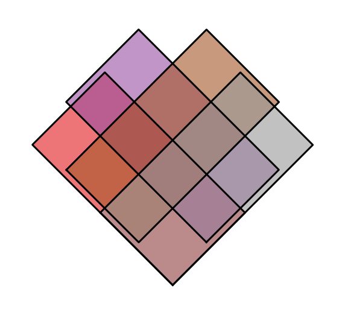
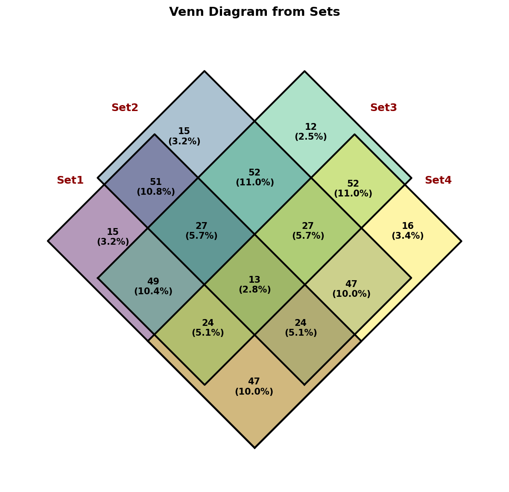
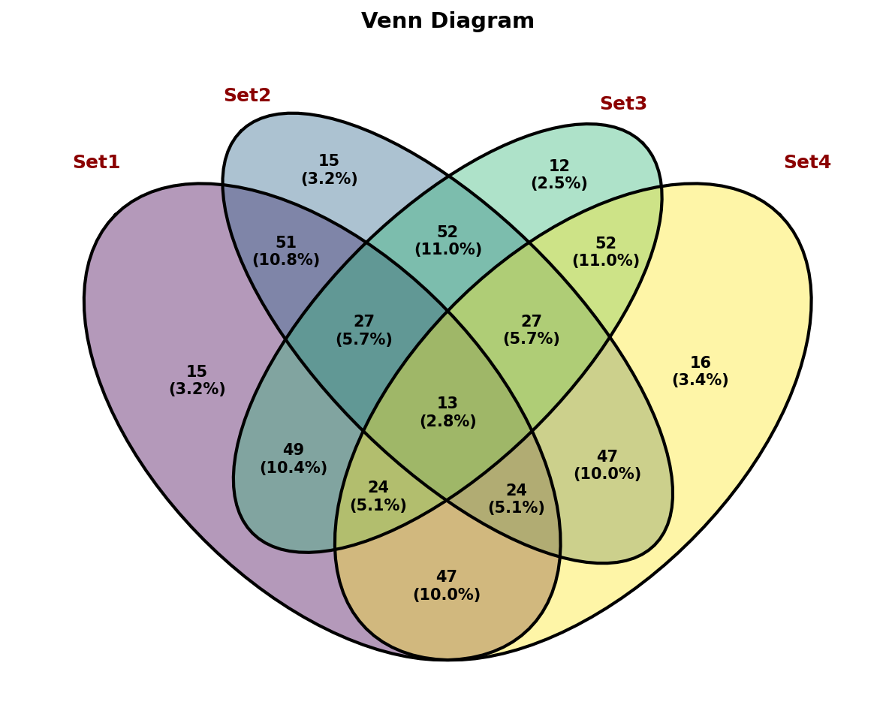
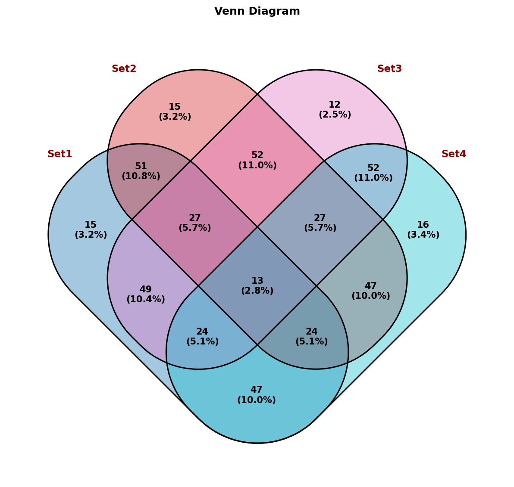
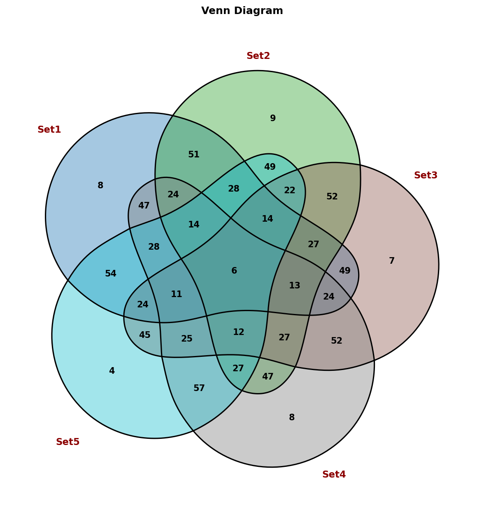
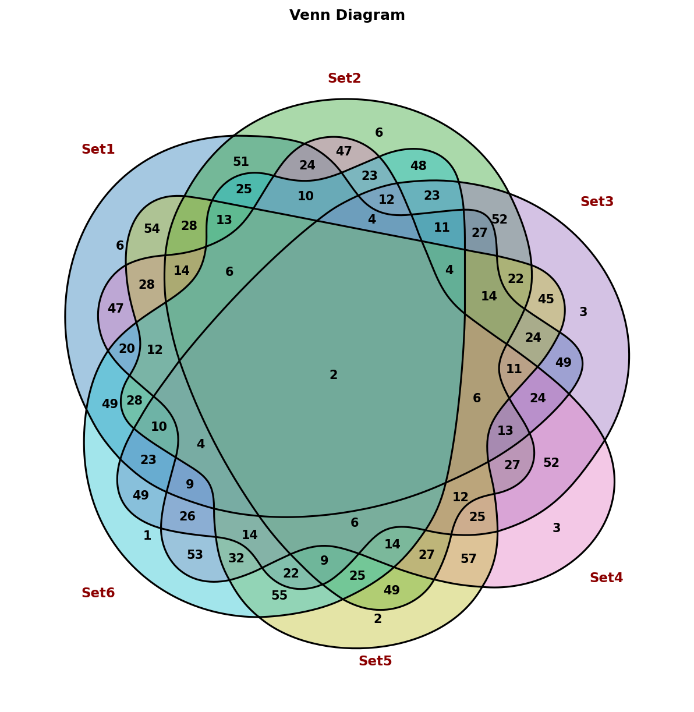
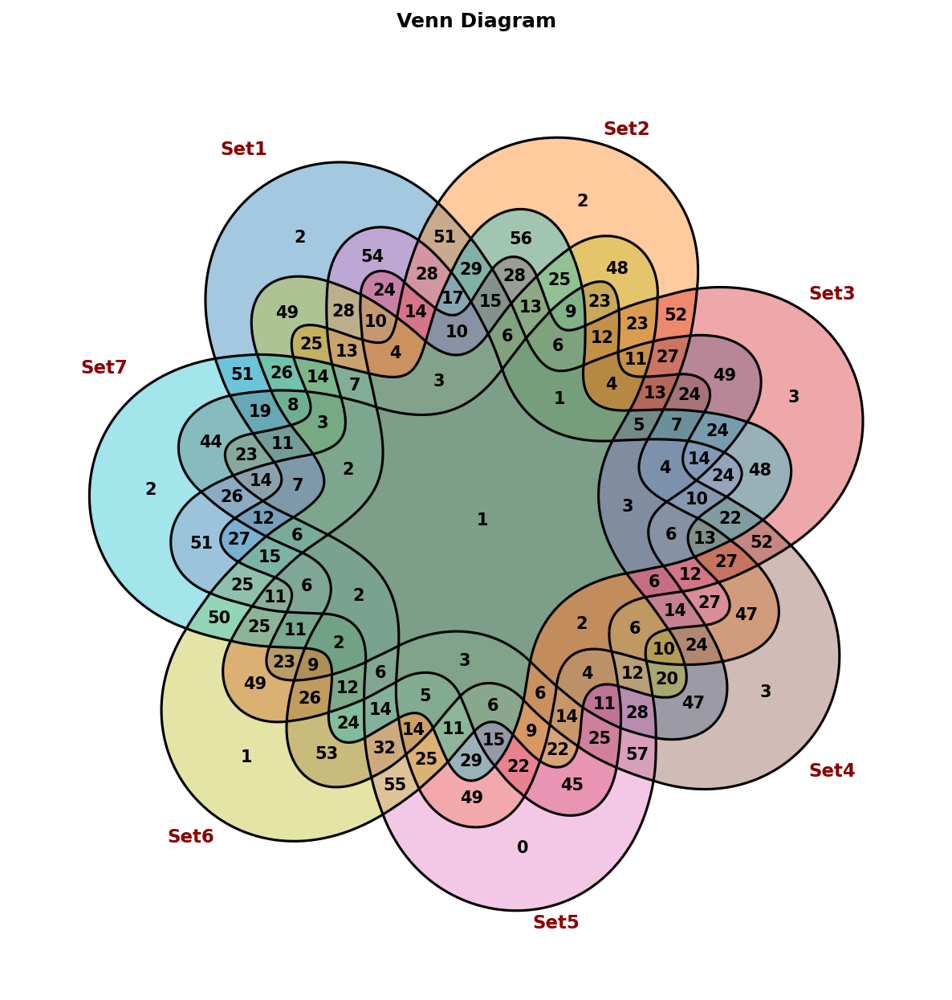

# overlapviz - Professional Set Visualization Toolkit （Under development!）


[](https://www.gnu.org/licenses/gpl-3.0)
[](https://www.python.org/downloads/)
[](https://pypi.org/project/pip/)

A Python toolkit for professional set visualization, transforming complex data overlaps into intuitive Venn and UpSet plots.











## 🚀 Features

- **Venn Diagrams**: Create beautiful Venn diagrams for 2-7 sets with customizable styling
- **UpSet Plots**: Visualize set relationships for 7+ sets (coming soon)
- **Pure matplotlib**: Built entirely with matplotlib for maximum flexibility
- **Automatic Selection**: Automatically choose the appropriate visualization type
- **Highly Customizable**: Extensive styling options with predefined themes
- **Data Integration**: Easy integration with pandas DataFrames and CSV files
- **Professional Output**: Publication-ready figures with high-resolution support

## 🛠️ Installation

### Prerequisites

- Python 3.12 or higher
- pip package manager

### Install in Development Mode (Recommended)

```bash
# Clone or navigate to the project directory
cd overlapviz

# Install in editable mode
pip install -e .
```

### Install with Development Dependencies

```bash
# Install with development tools
pip install -e .[dev]
```

### Using uv (Alternative)

```bash
# Create virtual environment with Python 3.13.2
uv venv --python 3.13.2 .venv

# Activate and install
source .venv/bin/activate  # On Windows: .venv\\Scripts\\activate
pip install -e .
```

## 📖 Quick Start

### Basic Usage

```python
from overlapviz import VennPlot, PlotStyle
import pandas as pd

# Create sample data
sample_data = pd.DataFrame({
    'set_names': ['A', 'B', 'C', 'A_B', 'A_C', 'B_C', 'A_B_C'],
    'size': [10, 15, 8, 5, 3, 4, 2]
})

# Create and draw a Venn diagram
venn = VennPlot()
venn.plot(sample_data, title="Sample Venn Diagram")
```

### Using Predefined Styles

```python
from overlapviz import VennPlot, PlotStyle

# Use a predefined style
venn = VennPlot(PlotStyle.paper())  # Professional paper style
venn.plot(sample_data, title="Professional Venn Diagram")

# Other available styles:
# - PlotStyle.bold() - Vivid colors, thick borders
# - PlotStyle.soft() - Soft colors, thin borders
# - PlotStyle.dark() - Dark theme
# - PlotStyle.poster() - Large font presentation
```

### Customizing Colors

```python
from overlapviz import VennPlot

venn = VennPlot()

# Define custom colors for specific regions
custom_colors = {
    'A': '#FF6B6B',  # Red
    'B': '#4ECDC4',  # Teal
    'C': '#45B7D1',  # Blue
    'A_B': '#FFBE0B',  # Yellow
    'A_C': '#FB5607',  # Orange
    'B_C': '#8338EC',  # Purple
    'A_B_C': '#3A86FF'  # Light blue
}

venn.set_custom_colors(custom_colors)
venn.plot(sample_data)
```

## 📊 Advanced Usage

### Working with Different Data Sources

```python
from overlapviz import VennPlot

venn = VennPlot()

# From DataFrame
dataframe_data = pd.DataFrame({
    'set_names': ['A', 'B', 'C'],
    'size': [10, 15, 8]
})
venn.plot(dataframe_data)

# From CSV file
venn2 = VennPlot()
venn2.plot('path/to/data.csv')
```

### Custom Label Formatting

```python
from overlapviz import VennPlot

venn = VennPlot()

# Format labels as percentages
venn.draw(sample_data, label_formatter='percentage')

# Use custom formatter
def my_formatter(value):
    return f"N={int(value)}"

venn.set_label_formatter(my_formatter)
venn.draw(sample_data)
```

### Getting Statistics

```python
from overlapviz import VennPlot

venn = VennPlot()
venn.draw(sample_data)

# Get statistics about the diagram
stats = venn.get_statistics()
print(f"Number of regions: {stats['n_regions']}")
print(f"Number of sets: {stats['n_sets']}")
print(f"Total size: {stats['total_size']}")
```

### Analyzing Detailed Overlaps and Elements

```python
from overlapviz.core import OverlapCalculator

# Create sample set data
sets_data = {
    'SetA': {'gene1', 'gene2', 'gene3', 'gene4'},
    'SetB': {'gene2', 'gene3', 'gene5', 'gene6'},
    'SetC': {'gene3', 'gene4', 'gene6', 'gene7'}
}

# Create calculator
calc = OverlapCalculator(sets_data)

# >>> from overlapviz.core import OverlapCalculator
# >>> 
# >>> # Create sample set data
# >>> sets_data = {
# ...     'SetA': {'gene1', 'gene2', 'gene3', 'gene4'},
# ...     'SetB': {'gene2', 'gene3', 'gene5', 'gene6'},
# ...     'SetC': {'gene3', 'gene4', 'gene6', 'gene7'}
# ... }
# >>> calc = OverlapCalculator(sets_data)
# >>> calc.get_plot_data()
#             set_names  n_sets  size        elements
# 0  SetA & SetB & SetC       3     1         [gene3]
# 1         SetA & SetB       2     2  [gene2, gene3]
# 2         SetA & SetC       2     2  [gene3, gene4]
# 3         SetB & SetC       2     2  [gene3, gene6]
# 4                SetA       1     1         [gene1]
# 5                SetB       1     1         [gene5]
# 6                SetC       1     1         [gene7]


# Get all overlap combinations with their elements
all_overlaps = calc.query_elements()

# Print detailed overlap information
for combo in all_overlaps:
    if combo['size'] > 0:  # Only show non-empty overlaps
        print(f"{combo['set_names']}: {combo['size']} elements")
        print(f"  Elements: {sorted(combo['elements'])}")
        print(f"  Exclusive elements: {sorted(combo['exclusive_elements'])}")
        print()

# Query specific combination
specific_combo = calc.query_elements(['SetA', 'SetB'])
print(f"A ∩ B: {specific_combo['elements']}")

# Compute all overlaps with size thresholds
df_overlaps = calc.compute(min_size=1)  # Only non-empty
print("\nAll non-empty overlaps:")
print(df_overlaps[['set_names', 'size', 'elements']])

# Get exclusive elements for each set
exclusive_df = calc.compute_exclusive()
print("\nExclusive elements for each set:")
print(exclusive_df[['set', 'exclusive_size', 'exclusive_elements']])

# Get pairwise overlap matrices
matrices = calc.get_pairwise_overlap()
print("\nPairwise overlap matrix:")
print(matrices['overlap_matrix'])
print("\nJaccard similarity matrix:")
print(matrices['jaccard_matrix'].round(3))
```

### Saving Figures

```python
from overlapviz import VennPlot

venn = VennPlot()
venn.draw(sample_data)

# Save with high resolution
venn.save('my_venn.png', dpi=300)
venn.save('my_venn.pdf')  # PDF format
```

## 🧪 Testing

To run the tests:

```bash
# Install development dependencies
pip install -e .[dev]

# Run tests
pytest
```

### Development Setup

```bash
# Clone the repository
git clone https://github.com/Dot4diw/overlapviz.git
cd overlapviz

# Create virtual environment
python -m venv venv
source venv/bin/activate  # On Windows: venv\\Scripts\\activate

# Install in development mode
pip install -e .[dev]
```

## 📄 License

This project is licensed under the GNU General Public License v3.0 (GPL-3.0) - see the [LICENSE](LICENSE) file for details.

**Note**: This is a copyleft license that requires any derivative works to also be distributed under the same license terms.

## 🙏 Acknowledgments

- Built with [matplotlib](https://matplotlib.org/) for visualization
- Uses [pandas](https://pandas.pydata.org/) for data manipulation
- Inspired by the need for professional set visualization tools
- This project was inspired by the ggVennDiagram package (https://github.com/gaospecial/ggVennDiagram)

## 🐛 Issues

If you encounter any issues or have suggestions for improvements, please open an issue on GitHub.

